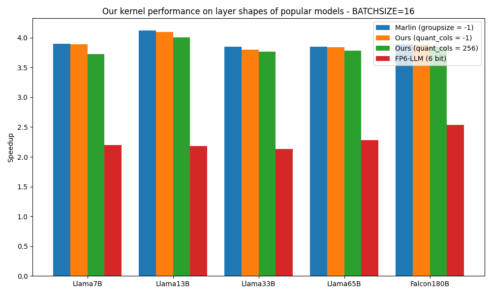

# FP6-Marlin: INT4&FP6 Mixed Quantization

An optimized W(4&6)A16 quantization kernel. 

Credit to [Marlin](https://arxiv.org/abs/2408.11743) and [FP6-LLM](https://arxiv.org/abs/2401.14112) for their original implementations.

## Usage

Use this command to install:

```bash
pip install -e .
```

Use these commands to run the example:

```bash
python test.py
python bench.py
```

## Performance

I test the performance of the quantization kernel with its baselines on an NVIDIA 4090D GPU. The results are as follows:



Our kernel can maintain nearly the same speedup as the original Marlin kernel while quantizing 256 'significant' columns of the weight matrix into `FP6` format.
